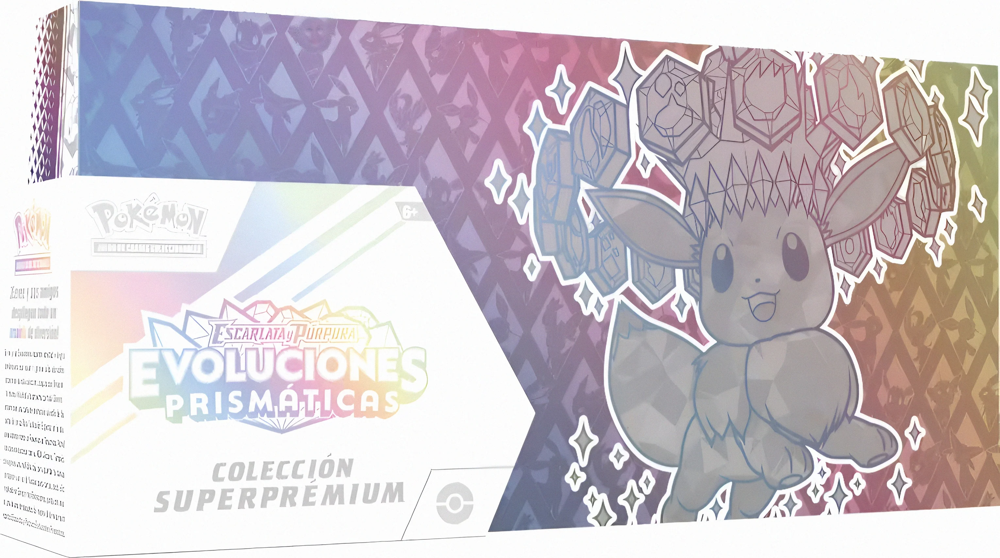

<meta name="description" content="Enter the Pokémon TCG Standard Tournament at the Gibraltar Card Show 2025. Battle through Swiss rounds and Top 8 for a chance to win exclusive prizes.">
<meta property="og:image" content="featured-image.png" />

<section class="event-card">
  

    

Registration

9:30 AM

    

Start time

10:00 AM

  

  

    

Format

Standard

    
The Pokémon TCG Standard format is the primary competitive format for official Play! Pokémon events.
      For the 2025 season, cards with the <strong>“F” regulation mark</strong> have rotated out, and only cards with
      <strong>“G”</strong> and <strong>“H”</strong> regulation marks (plus any future marks) are legal.
      Older prints of a card can still be used if a current legal version exists.
      Full details are available on the official Pokémon site:
      <a href="https://www.pokemon.com/us/pokemon-news/2025-pokemon-tcg-standard-format-rotation-announcement" target="_blank" rel="noopener">
        pokemon.com – 2025 Standard Format Rotation
      </a>.
    

  

  

    

Rounds

4 + Top 8

    
Players will compete in 4 Swiss rounds to determine standings.
      The top 8 players will then advance to single‑elimination knockout rounds until a champion is crowned.

    
All rounds will be played as best of three matches and last 50 minutes.

  

  

    

Prizes

    
Prizes are being provided courtesy of <a href="https://toycorner.gi/">Toy Corner</a>, our event sponsor.
      First place will take home a <strong>Prismatic Evolutions Super Premium Bundle</strong> More prizes to be announced soon!

  

  

    

Tickets

<a href="/tickets">Available Now</a>

    
Tickets include entry into the Gibraltar Card Show and participation in the tournament.

  

  

    
Helpful Resources

    <ul style="margin: 0; padding-left: 18px; line-height: 1.55;">
      <li><a href="https://www.pokemon.com/us/play-pokemon/about/tournaments-rules-and-resources/">Play! Pokémon Tournament Rules Handbook</a></li>
      <li><a href="https://bulbapedia.bulbagarden.net/wiki/2025-26_Standard_format_(TCG)" target="_blank" rel="noopener">Bulbapedia – 2025–26 Standard Format Overview</a></li>
      <li><a href="#" id="tiebreakerLink">Tiebreaker Rules</a></li>
    </ul>
  

</section>

<!-- Modal lives OUTSIDE the wrapper -->

  

    &times;

<h2 style="margin-top:0;">Tiebreaker Rules</h2>

  

    <strong>🟦 Swiss Rounds (can end in a draw)</strong>
    <ul style="margin:8px 0 0 20px; padding:0;">
      <li>When time is called, players have ten minutes to finish the current turn and then play one more full turn.</li>
      <li>If there is no winner after those turns, the game is a draw.</li>
    </ul>
  

  

  

    <strong>🟥 Top Cut / Elimination (must have a winner)</strong>
    <ul style="margin:8px 0 0 20px; padding:0;">
      <li>Same procedure as above.</li>
      <li>If 10 minutes expire and there is no winner:</li>
      <ul>
        <li>The player with a Prize card lead is declared the winner.</li>
        <li>If Prizes are tied a tie-breaker game (normal 6‑Prize setup) will be played to determine the winner. The first player to establish a Prize card lead, or to win the game outright by any other method, is the winner.</li>    
      <ul>
    </ul>
  

